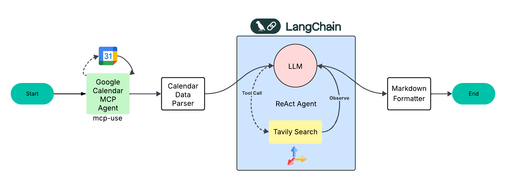

# 🗓️ Meeting Prep Agent

<div align="center">
  <video src="images/meeting-prep-agent.mp4" width="600" controls></video>
</div>


## 👋 Welcome to the Tavily Meeting Prep Agent!

This repository demonstrates how to build a meeting preparation agent with real-time web access, leveraging Tavily's advanced search capabilities. This agent will connect to your Google Calendar via MCP, extract meeting information, and use Tavily search for profile research on the meeting attendees and general information on the companies you are meeting with.

The project is designed for easy customization and extension, allowing you to:

- Integrate proprietary or internal data sources
- Modify the agent architecture or swap out LLMs
- Add additional Meeting Coordination Platform (MCP) integrations

---

## 🚀 Features

- 🌐 **Real-time Web Search:** Instantly fetches up-to-date information using Tavily's search API.
- 🧠 **Agentic Reasoning:** Combines MCP and ReAct agent flows for smarter, context-aware responses.
- 🔄 **Streaming Substeps:** See agentic reasoning and substeps streamed live for transparency.
- 🔗 **Citations:** All web search results are cited for easy verification.
- 🗓️ **Google Calendar Integration:** (via MCP) Access and analyze your meeting data.
- ⚡ **Async FastAPI Backend:** High-performance, async-ready backend for fast responses.
- 💻 **Modern React Frontend:** Interactive UI for dynamic user interactions.

## System Diagram


---
## 📂 Repository Structure

- **Backend** ([`backend/`](./backend))
  - [`agent.py`](./backend/agent.py): Agentic flow (MCP + LangChain-Tavily ReAct agent)
- **Frontend** ([`ui/`](./ui)): React-based UI for meeting insights
- **Server** ([`app.py`](./app.py)): FastAPI server for API endpoints and streaming

---


## 🛠️ Local Setup

**Python version:** 3.13.2 (local development)

### Google Calendar MCP Setup

See [google-calendar-mcp](https://github.com/nspady/google-calendar-mcp) for full details.

**Google Cloud Setup:**
1. Go to the Google Cloud Console and create/select a project.
2. Enable the Google Calendar API.
3. Create OAuth 2.0 credentials:
   - Go to Credentials
   - Click "Create Credentials" > "OAuth client ID"
   - Choose "User data" for the type of data that the app will be accessing
   - Add your app name and contact information
   - Select "Desktop app" as the application type
4. Add your email as a test user under the OAuth Consent screen.
5. Create a file `gcp-oauth.keys.json` in the root of `google-calendar-mcp` directory.
5. Download your credentials and paste them in `gcp-oauth.keys.json`.

This file should look like:

```json
{
  "installed": {
    "client_id": "<your-client-id>",
    "project_id": "<your-project-id>",
    "auth_uri": "<your-auth-uri>",
    "token_uri": "<your-token-uri>",
    "auth_provider_x509_cert_url": "<your-auth-provider>",
    "client_secret": "<your-secret>",
    "redirect_uris": ["http://localhost"]
  }
}
```

**Install the  MCP:**
```bash
cd google-calendar-mcp
npm install
```

**Set config path:**
```bash
GOOGLE_CALENDAR_CONFIG=<absolute-path-to-project>/mcp-use-case/google-calendar-mcp/build/index.js
```
Run the notebook [`mcp-test.ipynb`](./notebooks/mcp-test.ipynb) to check that your MCP setup is working before proceeding.


### Backend Setup

1. Create and activate a virtual environment:
    ```bash
    python3 -m venv venv
    source venv/bin/activate  # On Windows: .\venv\Scripts\activate
    ```
2. Install dependencies:
    ```bash
    python3 -m pip install -r requirements.txt
    ```
3. Set environment variables:
    ```bash
    export TAVILY_API_KEY="your-tavily-api-key"
    export OPENAI_API_KEY="your-openai-api-key"
    export GROQ_API_KEY=<"your-groq-api-key>
    export GOOGLE_CALENDAR_CONFIG="<absolute-path-to-project>/mcp-use-case/google-calendar-mcp/build/index.js"
    ```
4. Run the backend server:
    ```bash
    python app.py
    ```

### Frontend Setup

1. Navigate to the frontend directory:
    ```bash
    cd ui
    ```
2. Install dependencies:
    ```bash
    npm install
    ```
3. Start the development server:
    ```bash
    npm run dev
    ```

**.env file example:**
```env
TAVILY_API_KEY=your-tavily-api-key
OPENAI_API_KEY=your-openai-api-key
GROQ_API_KEY=your-groq-api-key
GOOGLE_CALENDAR_CONFIG=your-google-config
```

---


## 📡 API Endpoints

- `POST /api/analyze-meetings`: Handles streamed LangGraph execution

---

## 🤝 Contributing

Feel free to submit issues and enhancement requests!

---

## 📞 Contact

Questions, feedback, or want to build something custom? Reach out!

- Email: [Dean Sacoransky](mailto:deansa@tavily.com)

---

<div align="center">
  
  <p>Powered by <a href="https://tavily.com">Tavily</a> – The web API built for AI agents</p>
</div>
